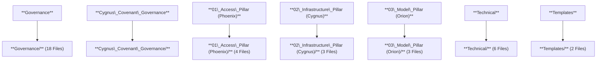

```mermaid
graph TD
    A["**Governance**"] --> B["**Governance/** (18 Files)"]
    C["**Cygnus\_Covenant\_Governance**"] --> D["**Cygnus\_Covenant\_Governance/**"]
    E["**01\_Access\_Pillar (Phoenix)**"] --> F["**01\_Access\_Pillar (Phoenix)/** (4 Files)"]
    G["**02\_Infrastructure\_Pillar (Cygnus)**"] --> H["**02\_Infrastructure\_Pillar (Cygnus)/** (3 Files)"]
    I["**03\_Model\_Pillar (Orion)**"] --> J["**03\_Model\_Pillar (Orion)/** (3 Files)"]
    K["**Technical**"] --> L["**Technical/** (6 Files)"]
    M["**Templates**"] --> N["**Templates/** (2 Files)"]
```
